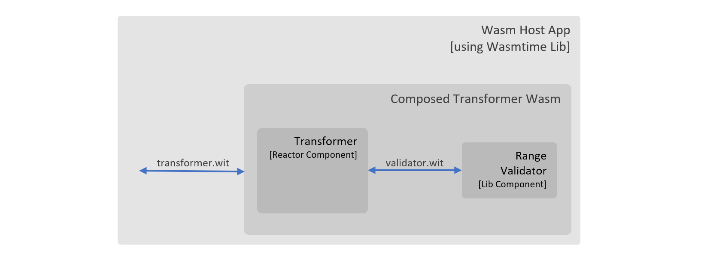

# A Simple Rust Program to Demonstrate Web Assembly (Wasm) Components with Wasmtime Embeddings

A repo to demo how we can make use of Wasm component model in a host program which embeds Wasmtime. We indent to provide host programs in Rust and GoLang initially.

The repo provides an accelerator to execute wasm components as part of a larger project/solution e.g. running wasm component in a data pipeline solution which is written in Rust or GoLang.

## Dev Setup

The repo makes use of Dev container for building and trying the accelerator.

## How to Build/Run

Run `make` in terminal at root of the project.

## TODOs

1. Enable standard WASI 2 preview imports in wasm component when required.
2. Change GoLang host to load wasm components (instead of modules) when it will be supported in wasmtime-go.
